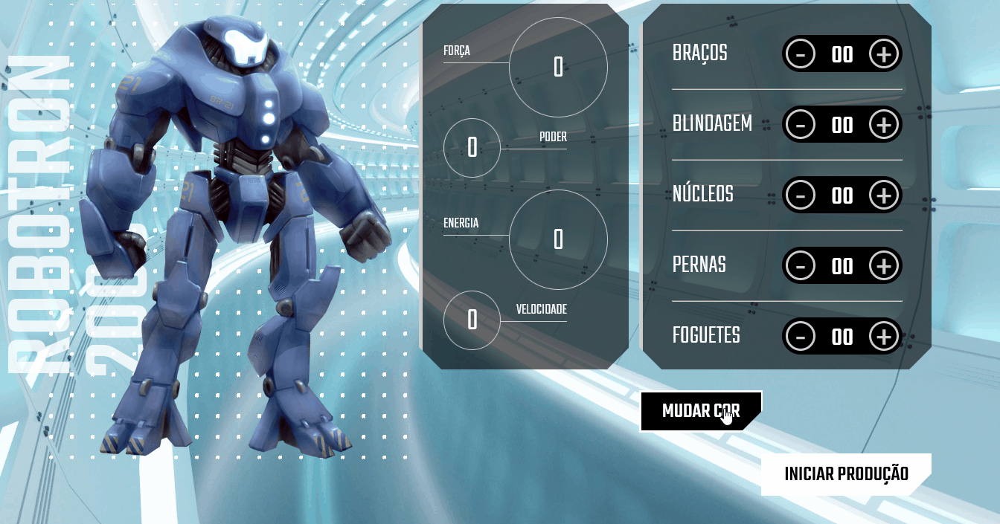

<h1 align="center"><a href="#">ROBOTRON 2000</a></h1>

Projeto de estudo de manipulação do DOM com Javascript pela Alura.

## Deploy
Projeto hospedado no Vercel:
[Robotron](https://vercel.com/vicbuss/robotron/settings/domains/)

  <a href="#-tecnologias">Tecnologias</a>&nbsp;&nbsp;&nbsp;|&nbsp;&nbsp;&nbsp;
  <a href="#-projeto">Projeto</a>&nbsp;&nbsp;&nbsp;|&nbsp;&nbsp;&nbsp;
  <a href="#memo-licença">Licença</a>

	

  

<h3 align="center">
  Atualização dinâmica de <em>stats</em>
</h3>

---

<h3 align="center">
  Mudança dinâmica de cor do robô
</h3>

---

## 🛠️ Tecnologias/ Ferramentas

Esse projeto foi desenvolvido com vanilla Javascript 

 

## 📃 Projeto

Projeto de estudo de manipulação do DOM com Javascript

Durante o curso, foram implementados scripts para garantir que os botões ajustassem os <em>stats</em>
do robô de forma dinâmica.

Foi trabalhado a manipulação de <em>data attributes</em>, além da atualização do <em>display</em> por meio da manipulação de listas de objetos.

Como desafio final ao aluno, foi pedido que se implementasse um modo de alterar as cores do robô dinamicamente.

A minha solução foi, em primeiro lugar, criar uma lista de objetos contendo o caminho para as diferentes imagens do robô.

Em seguida, criei um botão de alteração de cores, que, ao clicado, manipularia um contador que vai de 0 a 5 (com uma condição para resetar o contador ao se ultrapassar o número 5).

O contador faz referência ao índice de objetos da lista, de modo que, a cada clique, o atributo <em>source</em> da imagem do robô será sobrescrito, carregando uma imagem diferente.

## ⚙️ Como usar

Basta clicar nos botões e ajustar os atributos do robô. Tente otimizar seu design e não ter nenhum atributo negativo.

O botão "Iniciar produção" é apenas um <em>placeholder</em>, servindo para recarregar a página.
 

 
 

## 🚀 memo: Licença

Esse projeto está sob a licença MIT.

---

Feito por Victor Bussiki  [ 🌐 LinkedIn.](https://www.linkedin.com/in/victor-bussiki-96929051)